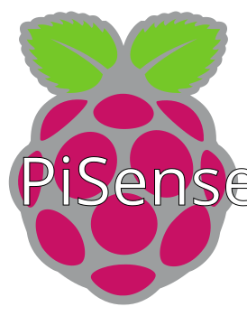

> # PiSense Lite
>
> *Lite version of the project, with a focus on small energy consumption and compatibility with Home Assistant.*
> 
> Be aware this part of PiSense is purely for personal use. The code might need to be adapted for your needs.



## The project

The project is to provide [Home Assistant](https://www.home-assistant.io/) with data from a sensor connected to a microcontroller.

In the case of this project, the microcontroller is a Raspberry Pi Pico W and the sensor selected is the Bosch BME680.
This sensor is interesting as it's a small and reliable one, giving measures of temperature, humidity, pressure and gas (which can be used to calculate VOC and AQI).
The Pico W is chosen as it has built-in WiFi capabilities, which will help us on requests between Home Assistant and the microcontroller.

The expected energy consumption should be around 50-60mA, making it quite energy efficient.

It is likely that other sensors will be added in the future, but the main priority is this first sensor.
Adapting the code for another microcontroller is possible (like an Arduino for example).

### Goal

* A fully working microcontroller with one or several sensors,
* An established communication between the microcontroller and Home Assistant via MQTT protocol,
* The integration of the sensors in a Home Assistant dashboard.

## Installation

For early adopters, feel free to follow this tutorial to connect your Raspberry Pi Pico to Arduino: <https://randomnerdtutorials.com/programming-raspberry-pi-pico-w-arduino-ide/>

In Arduino IDE, go into Preferences and enter the following URL into the "Additional Boards Manager URLs" field: <https://github.com/earlephilhower/arduino-pico/releases/download/global/package_rp2040_index.json>

You will also need to install couple modules in Arduino:

* Raspberry Pi Pico/RP2040
* WiFiManager
* PubSubClient

You will find in the Arduino file a bunch of variables at the beginning, feel free to adapt it to your needs:

```
// Replace with your WiFi credentials
const char* ssid = "YourSSID";
const char* password = "YourPassword";

// MQTT Broker
const char* mqtt_devicename = "PicoBME680"; // Name of the device in MQTT
const char* mqtt_server = "192.168.xxx.xxx"; // IP of the MQTT broker (Home Assistant)
const int mqtt_port = 1883; // Default port of Mosquitto MQTT is 1883. The secure one with SSL/TLS is 8883.
const char* mqtt_user = "mqttUserName";
const char* mqtt_password = "mqttPassword";
```
**Be sure you have MQTT installed on your Home Assistant as well as Mosquitto broker.**

In your Home Assistant, open the file editor and edit `configuration.yaml` to include the following:

```
mqtt:
  sensor:
    - name: "PiSense Temperature"
      state_topic: "home/pisense/bme680"
    - name: "PiSense Humidity"
      state_topic: "home/pisense/bme680"
    - name: "PiSense Pressure"
      state_topic: "home/pisense/bme680"
    - name: "PiSense Gas Resistance"
      state_topic: "home/pisense/bme680"
```

## License

This project is, by now on, protected under GNU General Public License v3.0 (see [LICENSE file](../LICENSE)).
It's made available on GitHub for "documentation" purpose.

If you want to distribute it and/or use it commercially, please reach me before doing anything.
This condition is here since the very start of this repository project and is not meant to block the usage of my code.
It is only to be sure rights, patents and distribution are well respected based on me, the author.

## Built With and For

  
