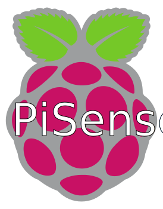

> # PiSense
>
> *Originally: graduation work, 3rd Bachelor at EPHEC Louvain-la-Neuve*
>
> *Development pursued after the defense (project was well seen by the jury).*

## The project

As part of a business request by Dreamnet SRL, an IoT system that tracks temperature, humidity and CO2 in a room is required to meet a future project to new needs.

Based on first feedback with Professor A. Dewulf (EPHEC), there is also interest in detecting Silicon Oxide from a client with a career.
This will allow the customer to prevent any risk related to the presence of Silicon Oxide at a rate too high.

> *The project is now functional under a [localhost web](localhost-web/) version with further options available on each sensors made compatible.*
>
> *If you want to use an external [web](web/) environment, please create your own API/database server with an online web environment.*
> *The Raspberry Pi code has a flag to fluently send collected data to an external environment.*

### Goal

Allow the optimization of the staff environment.
Studies have shown that a room with the right room temperature and good air quality can help focus and improve human health and productivity.

Multiple articles have been published, both from researchers and journalists based on the various studies carried out.
To cite only a few french sources, these two are explaining in summary the value of monitoring and optimizing the environmental data of the workplace:

* <https://www.francetvinfo.fr/replay-radio/c-est-mon-boulot/la-chaleur-a-des-effets-negatifs-sur-la-productivite_3486911.html>
* <https://www.forbes.fr/management/bonheur-au-travail-le-corps-ce-grand-oublie/>

In addition, it seems that in the professional environment, air pollution is an aggravating factor for respiratory pathologies.
An article correlate the facilitated spread of COVID-19 in this type of environment, was published by Le Soir and is available at the following address:

* <https://www.rtbf.be/info/societe/detail_le-coronavirus-pourrait-rester-plusieurs-heures-dans-l-air-a-cause-de-la-pollution-atmospherique?id=10464049>

In the case of the teacher's return, it would be a matter of warning of a possible danger in a risky work environment.

### Further research (after graduation defense)

After my graduation defense, I decided to pursue this project during my free time.
That's why I still make some commits 😉

By making further research, I learned that a desirable temperature is between 19 and 24°C (Canadian CSA Z412-17 Office Ergonomics suggest between 20 and 26°C).
The average humidity level is usually between 50 and 60% indoors even though between 40 and 70% there may not be high concerns.
Some articles and research published online explain this:

* <https://www.ccohs.ca/oshanswers/phys_agents/thermal_comfort.html>
* <http://ijesi.org/papers/Vol(4)3/Version-1/B043107014.pdf>
* <https://www.rubson.com/fr/a-propos-d-humidite/causes/niveau-parfait-humidite.html>

It seems that a bad humidity level can be linked to building and health aggravations.
For example:

* Humidity level below 20% can cause discomfort through dried eyes, mucous membranes and skin, skin and throat irritation.
It also causes static electricity build-up and negatively affect the operations of some office equipment such as printers and computers.
Apparently, it also has an impact on an easier drop in temperature which facilitates drying out the surrounding air.
* Humidity level above 70% may develop condensation on surfaces and within the interior of some equipment and building structures. If threatened, these areas can develop mould and fungi but also makes the area feel stuffy.
People with allergies may see their allergic reactions possibly worsening.

### Revival of the project (PiSense Lite, starting Q4 2024)

After taking a break from the project, I decided to work back on it with a lighter version, designed to be used in combination with a Home Assistant system.

If you are not aware, Home Assistant is an open source home automation system that puts local control and privacy first.
The project, from the Open Home Foundation, is stored on [GitHub](https://github.com/home-assistant) and their own [website](https://www.home-assistant.io/).

This revival, is stored under [PiSense-Lite with Home Assistant](PiSense-Lite%20with%20Home%20Assistant/) folder.

## License

This project is, by now on, protected under GNU General Public License v3.0 (see [LICENSE file](LICENSE)).
It's made available on GitHub for "documentation" purpose.

If you want to distribute it and/or use it commercially, please reach me before doing anything.
This condition is here since the very start of this repository project and is not meant to block the usage of my code.
It is only to be sure rights, patents and distribution are well respected based on me, the author.

## Built With and For

 

   -informational?style=for-the-badge&color=777BB4&logo=php&logoColor=white)

* [PyCharm Community Edition](https://www.jetbrains.com/pycharm/) - A great Python IDE
