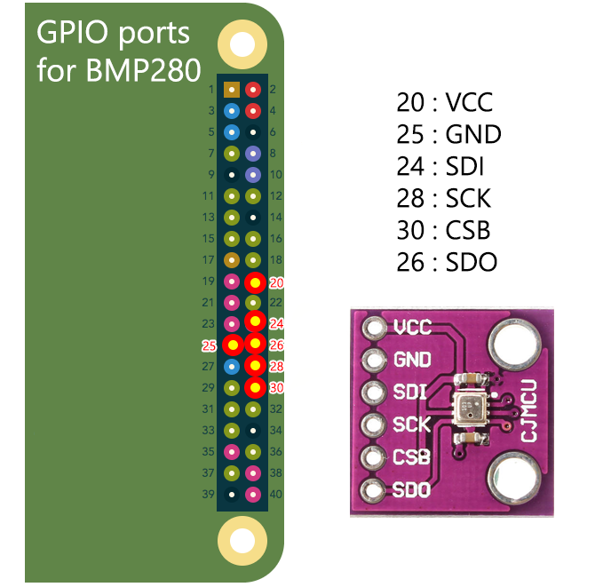
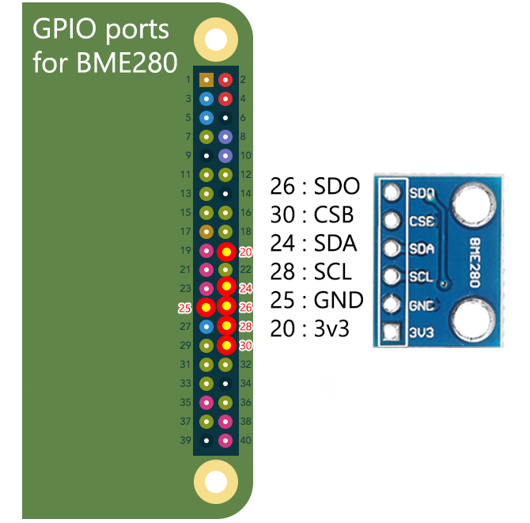

# Connect one or multiple sensors onto Raspberry Pi devices

Currently, this project support the following sensors:

* _Nova SDS011:_ Fine particles in suspension (PM2.5, PM10).
* _Bosch BMP280 (based on Adafruit library):_ temperature and humidity.
* _Bosch BME280 (based on Adafruit library):_ temperature, humidity, atmospheric pressure.
* _Bosch BME680 (based on Pimoroni library):_ temperature, humidity, gas (TVOC, eCO2), atmospheric pressure.

If for any reason you need to connect one of the sensors, here you will find a diagram to help you find out how to process it.

As it's meant to be connected on Raspberry Pi devices (this project is working on such device), take the board of the Raspberry in front of you with the GPIO connectivity port at your upper right side.
Like that, the diagram will correspond to your GPIO port.

## Nova SDS011 sensor

For this sensor, we are using the included Serial to USB adapter.

* Simply connect the cable on the SDS011 module on one side,
* On the other side, connect the cable on the USB adapter,
* Connect the adapter on one of the USB ports available on your Raspberry Pi device.
* You are done.

## Bosch BMP280 sensor

## Bosch BME280 sensor

## Bosch BME680 sensor

