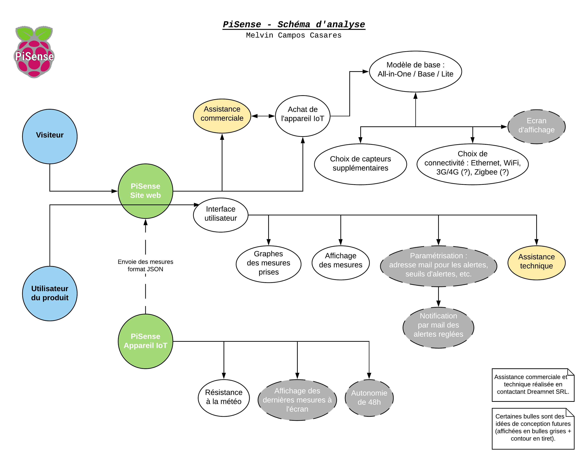
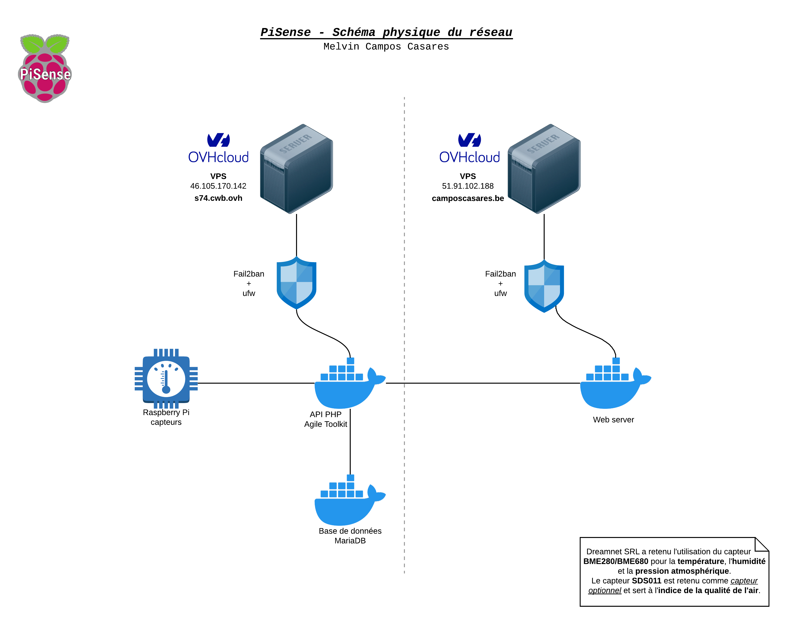
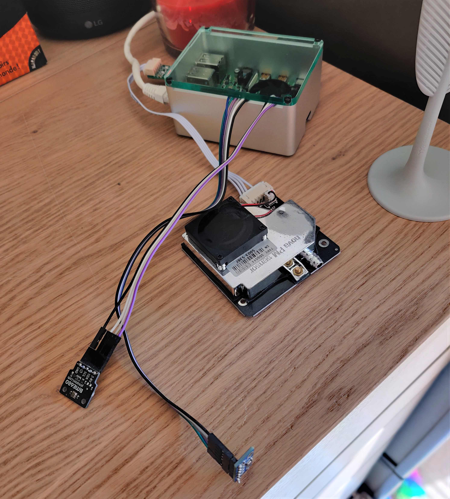
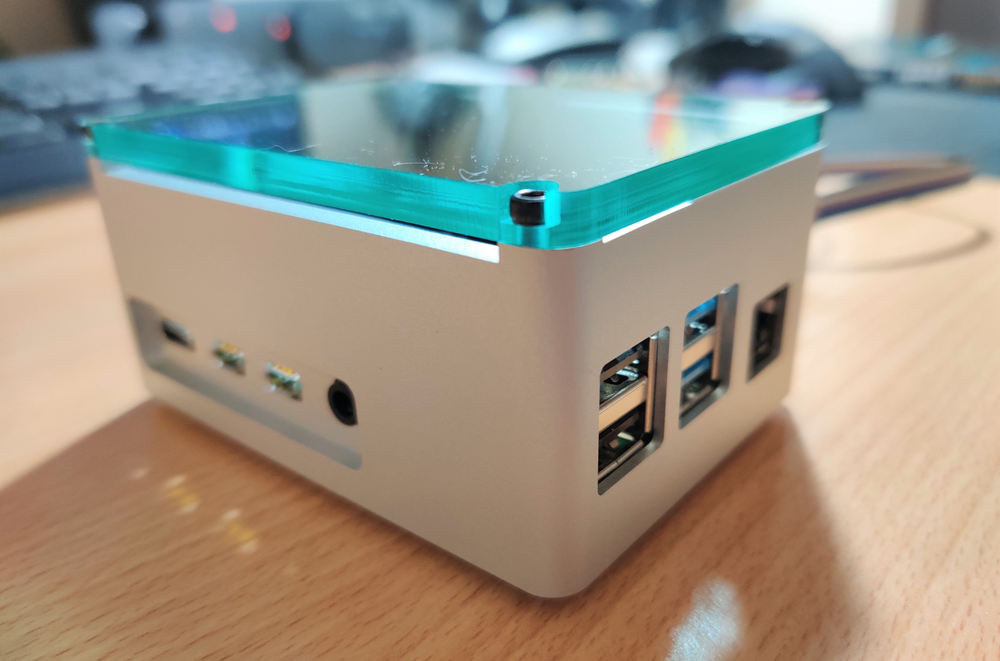
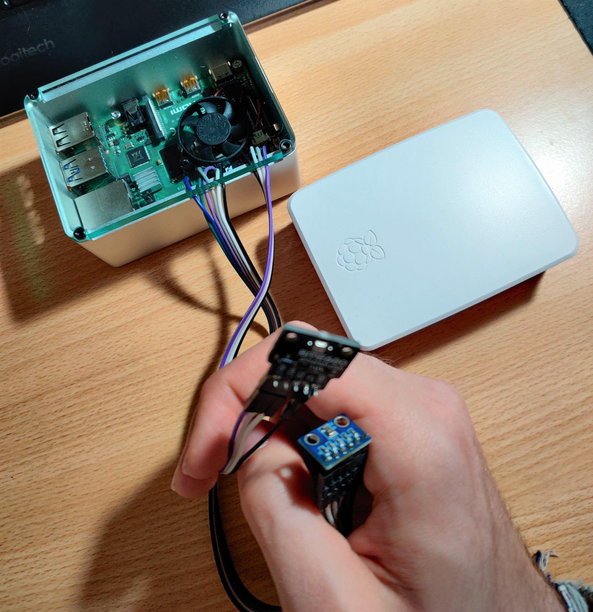
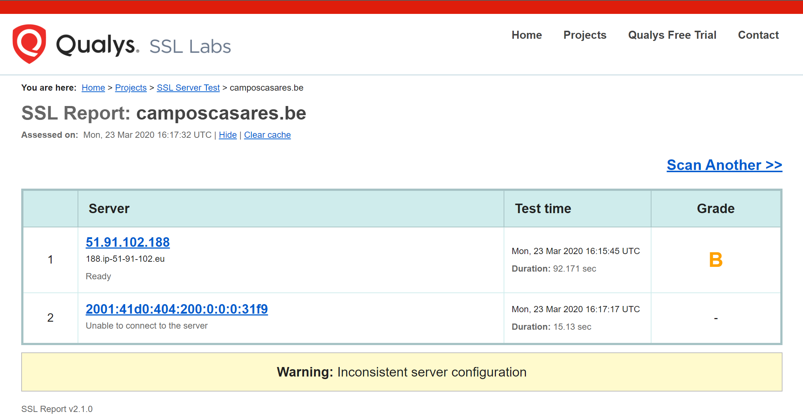
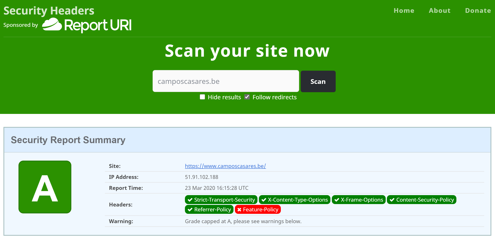
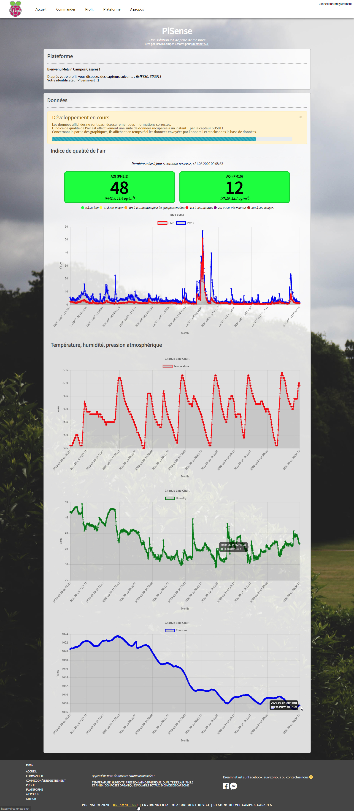
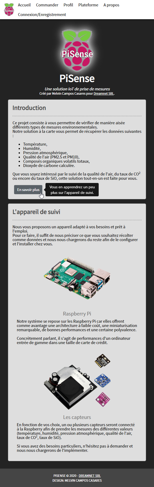
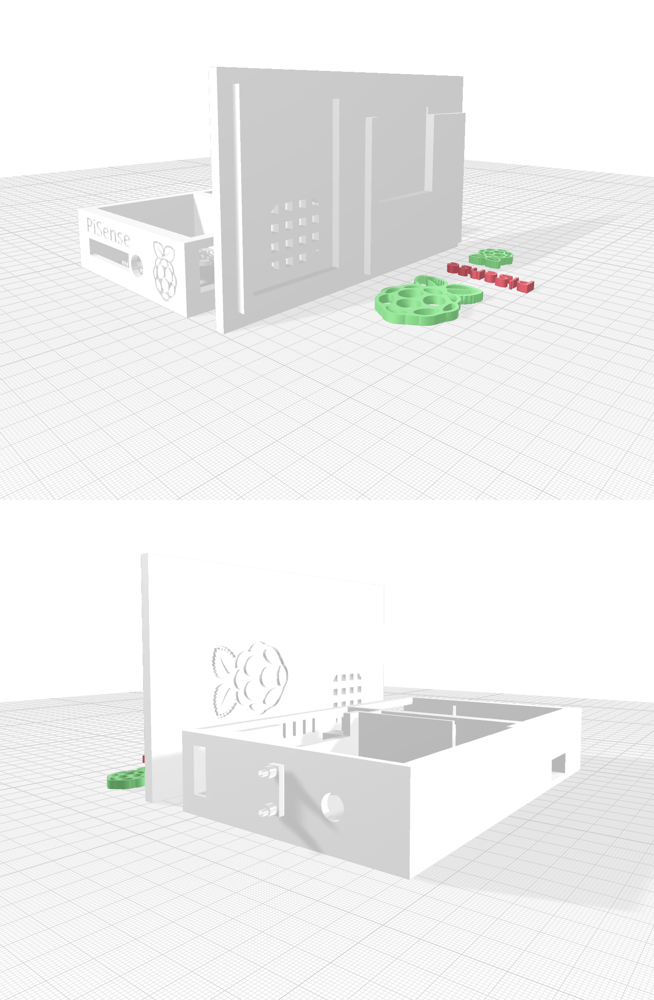

# Système modulable de prises de mesures environnementales sur Raspberry Pi avec système d’affichage

> _**Titre du travail de fin d'études :**_ Système modulable de prises de mesures environnementales sur Raspberry Pi avec système d’affichage
>
> _**Nom temporaire prévu pour sa commercialisation :**_ PiSense

**Préface**

Je souhaite tout d'abord remercier Dreamnet SRL et leurs contacts, car sans eux, ce projet n'aurait sans doute pas existé.
Leur soutien à été d'une grande aide malgré les circonstances atténuantes lié au COVID-19.

Je remercie également mon rapporteur de stage, le professeur Arnaud Dewulf, pour les multiples échanges que nous avons eus et qui m'a permis de me conforter dans le choix de certains capteurs et de particularités à tenir en compte au niveau de l'aspect électronique de ce travail de fin d'études.

Je remercie également le client venant du professeur Arnaud Dewulf qui m'a orienté vers une réflexion poussée sur LoRaWAN et Zigbee.
Cela m'a permis de tenir en compte de possibles ouvertures en termes de moyen de communication.
De plus, il m'a permis de rediriger mes choix de capteurs afin de rendre ce travail le plus générique possible avec possibilité de personnalisation.
Malheureusement, au vu des circonstances mondiales rencontrées, nos échanges n'ont finalement pas donné de suite.

**Mesures liées au Coronavirus**

Suite aux mesures liées au Coronavirus, un impact non négligeable a eu lieu envers l'avancement du TFE.
En effet, il a été nécessaire de réadapter les échanges avec les deux clients et n'ai plus eu de retour concernant l'un d'eux.
De plus, avec les mesures gouvernementales prises et vivant seul, la distanciation sociale s'est faite ressentir de façon conséquente, impliquant une perte de motivation.
Quelques soucis de santé ont également été rencontrés durant cette période, faisant qu'un retard au niveau du développement de ce projet s'est installé ; retard dont j'ai mis un point d'honneur à récupérer.

En concertation avec le client principal, Dreamnet SRL, le développement s'est vu adapté.
L'optique principale étant d'avoir l'appareil de suivi environnemental opérationnel (pouvant communiquer avec une API et inscrire les données au sein d'une base de données), l'aspect web s'est vu altéré afin de montrer la possibilité de communication, sans pour autant avoir une gestion d'inscription et connexion utilisateur.

Vu les règles en vigueur lors du confinement, les colis jugés non prioritaires ont été retardés, occasionnant ainsi un retard considérable pour la réception du capteur SDS011 permettant la mesure de l'indice de qualité de l'air.

\pagebreak

## Introduction

Nous vivons dans un monde en perpétuelle évolution où la technologie prend une place d’importance majeure.
Les appareils connectés passent peu à peu d’une idée de conception à un produit se trouvant dans chaque foyer.
Malheureusement, il est rare de trouver à l’heure actuelle une solution tout-en-un permettant de suivre les informations environnementales directement depuis une interface web simple et efficace.

Dans un désir de suivre les informations environnementales de mon espace de vie, j'ai pris contact avec plusieurs entreprises, afin de voir le potentiel derrière ce projet.

Suite à des échanges avec plusieurs clients potentiels, ce travail de fin d’études s’est peu à peu dessiné.
Une entreprise mettait en avant l’intérêt d’obtenir des données liées à la température, l’humidité et la qualité de l’air afin d’améliorer la productivité de leurs employés.
Une autre mettait en avant la nécessité de suivre l’évolution de la présence d’un gaz spécifique dans un lieu donné, afin de prévenir d’un danger pouvant s’avérer mortel.

**En combinant les besoins et intérêts, les prémices de ce travail sont nées et de nouvelles questions venaient en tête :**

* _Serait-il possible d’imaginer une solution de petite taille et répondant aux demandes ?_
* _Est-ce que cette solution peut être générique afin d’être ouvert a tous ?_

De plus, avec les récents évènements liés au COVID-19, une réflexion approfondie a été réalisée concernant la mesure de la qualité de l’air suite à la publication de recherches spécifiques au coronavirus.

Vous découvrirez dans ce rapport la façon dont ce travail a été développé ainsi que certaines analyses réalisées.

### Analyse du projet

Un schéma d'analyse et un schéma du réseau physique ont été réalisés afin d'offrir une vue d'ensemble rapide sur la solution mise en place.

Vous les découvrirez aux pages suivantes.





\pagebreak

## Informations générales de ce projet

### Contexte et présentation

Dans le cadre d’une requête professionnelle demandée par la société Dreamnet SRL, un système IoT permettant le suivi de la température, de l’humidité et du taux de CO2 au sein d’une pièce est requis afin de répondre à un projet futur faisant face à de nouveaux besoins.

Sur base de premiers retours avec le professeur A. Dewulf, un intérêt est également présent pour détecter de l’Oxyde de Silicium auprès d’un client disposant d’une carrière.
Cela permettra au client de prévenir de tous risques lié à une présence de l’Oxyde de Silicium à un taux trop élevé.

### But

Permettre l’optimisation de l’environnement du personnel.
Des études ont prouvé qu’une pièce à bonne température ambiante et avec une qualité d’air adéquate permet d’aider à la concentration et à améliorer l’état de santé ainsi que la productivité de l’être humain.

De multiples articles ont été publiés, tant venant de chercheurs que de journalistes se basant sur les différentes études réalisées.
Pour ne citer que quelques sources, en voici deux expliquant de façon synthétique l'intérêt de suivre les données environnementales du lieu de travail et de l'optimiser :

* <https://www.francetvinfo.fr/replay-radio/c-est-mon-boulot/la-chaleur-a-des-effets-negatifs-sur-la-productivite_3486911.html>
* <https://www.forbes.fr/management/bonheur-au-travail-le-corps-ce-grand-oublie/>

De plus, il semblerait que dans le milieu professionnel, la pollution atmosphérique est un facteur aggravant pour les pathologies respiratoires.
Un article allant dans ce sens, mettant en corrélation la propagation facilitée du COVID-19 dans ce type d'environnement, a été publié par Le Soir et est disponible à l'adresse suivante :

* <https://www.rtbf.be/info/societe/detail_le-coronavirus-pourrait-rester-plusieurs-heures-dans-l-air-a-cause-de-la-pollution-atmospherique?id=10464049>

Dans le cas des retours du professeur, il s’agirait de prévenir d’un éventuel danger dans un milieu de travail à risque.

### Besoins et contraintes

Il est demandé de mettre en place une solution IoT munie de capteurs « à la carte » ainsi que de différents moyens de communication au choix pour l’utilisateur final.

Ce choix permettra au client de définir ce dont il a besoin : Wi-Fi ou Ethernet.

Un moyen d’accès aisé aux informations est à mettre en place.
Le prix d’achat des composants pour créer l’appareil doit être le moins coûteux possible.
De ce fait, une analyse des différents composants disponibles sur le marché et de leur précision a été réalisée lors de l'élaboration du cahier de charges et de l'analyse technique afin de retenir uniquement les composants ayant un bon rapport précision/prix.

Concernant les nécessités du client disposant d’une carrière, une solution entièrement sans fil est à envisager.
L’utilisation d’une batterie d’une certaine capacité pourrait s’avérer pratique à moins que le client dispose d’une prise 220V non loin de la zone où il souhaite mettre en place l’appareil.

Malheureusement, au vu des problèmes rencontrés liés au confinement, les échanges avec le 2ème client n'ont plus eu lieu.

Étant donné que l’appareil pourrait être mis en extérieur, un boîtier étanche est à étudier.

#### Contraintes

* L’appareil IoT doit rester relativement petit (de taille « acceptable »),
* L’appareil IoT et les capteurs doivent être à un prix correct (volonté de ne pas dépasser les 500 € pour le kit complet avec tous les moyens de communication éventuellement intégrés),
* La possibilité à un développeur tiers d’accéder aux données de l’appareil via une API ou un environnement Cloud (non obligatoire, mais souhaité),
* La possibilité d’une solution entièrement sans fil,
* Résistance aux intempéries si l’appareil est mis en extérieur (résistance à la pluie).

\pagebreak

## Analyse de sécurité

En termes de sécurité, il va de soi que l'environnement web doit être sécurisé par un certificat SSL et une protection liée aux données des utilisateurs.
Dreamnet SRL conseille l'utilisation du certificat Let's Encrypt, étant un certificat gratuit et renouvelé de façon régulière.
L'augmentation de la sécurité par le biais de _Security Headers_ à implémenter sur la plateforme web est également une méthode intéressante à inclure.

> Concernant la sécurité mise en place sur la plateforme web, les éléments mis en place sont expliqués dans le point consacré à cet effet dans la section _Développement du projet > Site internet > Sécurité_.

Le moyen de communication de la Raspberry doit être le plus générique possible afin que même si une personne externe vient à récolter les informations, aucune information personnelle liée à l'utilisateur ne puisse être récupérée à son insu.

\pagebreak

## Développement du projet

### Méthodologie

Des réunions régulières ont été prévues avec Dreamnet SRL afin de s'assurer que la direction suivie soit la bonne.
La méthodologie suivie s'apparente donc aux méthodologies Agile et plus précisément Scrum.

Avec la période compliquée que nous avons subi, certaines contraintes ont été rencontrées, forçant de changer la manière de s'organiser ainsi que de la mise en place des réunions.

Le développement à débuté sur la partie IoT avec la Raspberry Pi pour ensuite laisser place au développement d'un site internet _"maquette"_.

### Raspberry Pi

Le développement a débuté avec la Raspberry Pi.
Plusieurs éléments ont été développés :

* Système de connexion à distance sécurisée par interface graphique via VNC Viewer (Raspberry Pi servant de serveur),
* Protection à la connexion par interface console par protocole SSH,
* Intégration d'un service permettant l'allongement de la durée de vie de la carte microSD,
* Développement d'un service permettant le refroidissement du processeur de la Raspberry Pi 4 via un ventilateur connecté sur le module GPIO intégré (la Raspberry Pi 4 est réputée pour avoir un processeur qui chauffe),
* Développement des différents capteurs.

Concernant les capteurs, tout a été développé avec le langage de programmation Python, l'intégration d'un service de logs avec rotation et suppression automatique de l'historique ancien de plus de 30 jours.

#### Capteurs

La réception des capteurs s'étant faite en plusieurs parties (3 fournisseurs différents pour 4 capteurs), 3 des 4 capteurs ont été reçus avant le confinement.
Le dernier capteur, le SDS011 permettant la mesure de l'indice de la qualité de l'air par le biais des normes PM2.5 et PM10, a été livré pratiquement 2 mois après avoir effectué la commande.

Voici les différents capteurs commandés et intégrés dans ce projet (ils sont tous fonctionnels) :

* _**Bosch BMP280**_ (modèle basé sur la librairie Adafruit) : prise de mesures de la température et humidité.
* _**Bosch BME280**_ (modèle basé sur la librairie Adafruit) : prise de mesures de la température, humidité et pression atmosphérique.
* _**Bosch BME680**_ (modèle de Pimoroni) : prise de mesures de la température, humidité, pression atmosphérique et calcul des taux de CO2 et composés organiques volatils totaux.
* _**Nova SDS011**_ : prise de mesures de l'air par le biais d'un laser et détection des particules fines d'après les normes de diamètre aérodynamique PM2.5 (< 2,5 µm) et PM10 (< 10 µm).

> À titre de comparaison, le diamètre aérodynamique d'un cheveu humain est de 50 à 70 µm.

En effet, mise à part le capteur BME680 en provenance du Royaume-Uni et commandé directement auprès de Pimoroni, les autres capteurs étaient tous en provenance de Chine.
Adafruit proposait de les commander directement de chez eux, mais le coût étant relativement conséquent, j'ai jugé bon de réduire les frais du TFE et commander les premiers capteurs dès la confirmation du sujet de TFE.

#### Journalisation d'événements, menu d'aide du script, etc.

En termes de dépassement, l'implémentation d'un système de rotation des fichiers "logs" propre à la Raspberry Pi avec suppression automatisée des fichiers datant de plus de 30 jours a été mise en place.
Toutes les informations jugées pertinentes _(données formatées en JSON et prêt pour l'envoi vers l'API, réponse de réussite ou d'erreur lors de l'envoi vers l'API, etc.)_ sont stockées dans un fichier de journalisation d'événements ayant la dénomination suivante : `NomDuCapteur.log.Année-Mois-Jour` _(exemple : bme680.log.2020-06-01)_.

De plus, un menu d'aide a été intégré pour chacun des capteurs permettant de démarrer le script avec la déclaration personnalisée de l'URL du serveur API, du temps entre chaque prise de mesures et la version du script présent sur l'appareil.

_**Voici le menu d'aide du capteur BME280 :**_

`mcc@RasbperryPi4: $ sudo python3 bme280/bme280sensor.py --help`

```fish
usage: PiSense BME280 [-h] [-u URL] [-t TIME] [-v]

BME280 module sensor of PiSense

optional arguments:
  -h, --help            show this help message and exit
  -u URL, --url URL     URL of the API
  -t TIME, --time TIME  Time, in seconds, between each record taken
  -v, --version         PiSense BME280 program version
```

#### Photos de l'appareil

Voici, aux pages suivantes, des photos de la Raspberry Pi 4 dans un boitier en aluminium, sous différents angles et avec les capteurs branché.







\pagebreak

### Site internet

Au niveau du site internet, il était originellement prévu de travailler sur une plateforme avec le framework React.JS.
J'ai rapidement pu remarquer les limites de cet environnement de développement par rapport aux besoins de ce projet et aie donc entrepris de changer d'environnement de travail.

#### Sécurité

##### Certificat Let's Encrypt (HTTPS)

Concernant la sécurité, le certificat HTTPS a été mis en place.
Let's Encrypt a été utilisé, avec `certbot` afin d'automatiser son renouvellement.

Let's Encrypt est une autorité de certification gratuite, automatisée et ouverte, exploitée pour le bénéfice du public. C'est un service fourni par l’Internet Security Research Group (ISRG).
Leur optique étant de créer un Web plus sûr et respectueux de la vie privée, ils offrent les certificats numériques pour activer le protocole de sécurité HTTPS (SSL/TLS) pour les sites web, gratuitement.

On peut remarquer sa mise en place sur le serveur web via le rapport de sécurité réalisé auprès de Qualys :



##### En-tête de sécurité

De plus, des security headers ont été mis en place afin d'assurer une protection supplémentaire de la plateforme web.
En protégeant les en-têtes de sécurité HTTP/HTTPS, les attaques et les vulnérabilités de sécurité sont atténuées.

Les en-têtes de sécurité HTTP sont la réponse au navigateur, lorsqu'il effectue une requête.
Certains de ces en-têtes contiennent de méta data de contenu tels que le code de statut, la méthode utilisée par la requête (GET/POST...), l'adresse URL de la requête, le contenu d'encodage et le contrôle de la cache.
Cela définit donc notamment comment le navigateur web doit réagir en affichant le contenu de la page web demandée.

Voici le rapport d'analyse des en-têtes de sécurité de la plateforme :



###### Content Security Policy (CSP)

Cette stratégie permet de prévenir des attaques, telles que le script de site croisé (XSS) et d'autres attaques d'injection de code en définissant les sources de contenu approuvées et en permettant au navigateur de les charger.

Dans la configuration du serveur NGINX, cela concerne : `Content-Security-Policy`.

###### Filtre de script de site croisé (X XSS-Protection)

L’en-tête est conçu pour activer le filtre de script de site croisé (XSS) intégré dans les navigateurs web modernes.
Il est généralement activé par défaut, mais le spécifier est toujours préférable.

Dans la configuration du serveur NGINX, cela concerne : `add_header X-XSS-Protection "1; mode=block" always;`

###### HTTP Transport de sécurité stricte (HSTS)

Il permet de restreindre les navigateurs web pour accéder au serveur web uniquement via le protocole de sécurité HTTPS.
Cela garantit que la connexion ne peut pas être établie via une connexion HTTP non sécurisée et ainsi prévenir de susceptibles attaques.

Dans la configuration du serveur NGINX, cela concerne : `Strict-Transport-Security`.

###### Protection de clics

En utilisant `X-Frame-Options`, une protection contre les clics est établie et les iframes ne peuvent pas être chargées sur le site web.

###### Blocage de détection de réponse éloignée

`X-Content-Type-Options` permet de prévenir la détection de réponse éloignée déclarée.
Cela permet de réduire le risque de téléchargements de type "drive-by" (= téléchargement de contenu autorisé sans tenir compte des conséquences (exécutable contrefait, application non reconnue/signée...)) et ainsi traiter le contenu de la bonne façon.

###### Référence de politique HTTP

`Referrer-Policy` contrôle la quantité d'informations de référence, qui doit être incluse dans les demandes.

Sur le serveur NGINX, `strict-origin-when-cross-origin` a été défini.
Concrètement, l'origine est envoyée (le chemin et la chaîne de requête) lors de l'exécution d'une demande de même origine.
L'origine n'est envoyée que lorsque le niveau de sécurité du protocole reste le même lors de l'exécution d'une demande d'origine croisée (HTTPS → HTTPS), et n'envoie aucun en-tête à un système moins sécurisé (HTTPS → HTTP).

#### Changement du serveur web vers Python Flask

Fin mars, j'ai entrepris la conversion complète du site internet pour travailler sur le framework Flask prévu pour Python.

Afin d'améliorer au maximum le rendement de ce framework, le modèle MVT a été suivi (ce modèle est expliqué à la suite dans un point dédié).
L'avantage de Python Flask est son intégration plus aisée de l'API ainsi que de la base de données.

Afin de comprendre au mieux l'utilisation de Flask, j'ai suivi la formation en ligne "Concevez un site avec Flask" sur OpenClassrooms.

##### Modèle MVT

Concernant la plateforme web, le modèle MVT (Modèle - Vue - Template) est suivi.

* Le modèle est la structure de l'objet dans la base de données.
  Concrètement, il est représenté par le fichier `models.py`.
* La vue décide du contenu qui sera affiché sur une page ; c'est elle qui génère le contenu à renvoyer aux requêtes adressées.
  Concrètement, il est représenté par le fichier `views.py`.
* Le template est un fichier HTML recevant des objets Python et lié à une vue.
  Concrètement, il est représenté par le dossier `templates` et tout fichier présent dans ce dernier.

##### API

Python Flask permet la mise en place d'une API (Application Programming Interface).
La documentation fournie sur le site internet officiel de Flask est relativement complète.

Dans le cadre de ce projet, j'ai suivi la formation en ligne "Adoptez les API REST pour vos projets web" sur OpenClassrooms.
Cette formation m'a permis de mieux visualiser les concepts théoriques derrière les API et ainsi orienter la programmation de ce dernier.

###### Changement de l'API vers PHP Agile Toolkit framework

Malheureusement, en avançant dans la construction de l'API, j'ai été face à quelques problèmes de compréhension afin de mettre en place correctement les éléments nécessaires pour finaliser le site web avec Python Flask.
Arrivé début mai, j'ai dès lors pris contact avec Dreamnet SRL afin de changer un peu les attentes du projet et convenir d'un arrangement.

Une partie du cahier de charges original concernant le site web est donc reléguée à un développement ultérieur, la partie échange de communication entre la Raspberry Pi et le site web étant la priorité.

Le langage final choisi est PHP avec Agile Toolkit et la conversion entre ce qui a déjà été réalisé sous Python Flask et le nouvel environnement sous PHP n'a pas occasionné un retard plus conséquent que celui déjà préexistant.

#### Impression d'écran de l'interface web

Voici l'interface utilisateur disponible en ligne.
Il présente de façon claire et détaillée les mesures prises des 30 derniers jours.
L'utilisateur peut parcourir avec sa souris les mesures prises à chaque instant s'il souhaite plus de détails.





\pagebreak

### Base de données

Lors du choix de technologies, il était décidé de partir sur MariaDB, car jugé plus intéressant en termes de fonctionnalités, stabilité et de la licence Open SQL Server en comparaison de MySQL.
Au vu de certaines incompatibilités rencontrées avec MariaDB lors de l'implémentation de l'environnement web sous Python Flask, SQLite a été le choix de prototypage retenu, mais MariaDB est bel et bien la solution retenue et déployée grâce au changement de structure utilisée lors de la mise en place de l'API.

Concrètement parlant, la base de données comporte 2 tables :

* _**User**_ :
  Elle contient toutes les informations liées à l'utilisateur. Nous y trouverons son nom et prénom, adresse e-mail, mot de passe (qui sera protégé), date d'inscription et s'il est en possession d'un appareil de suivi ainsi que de quel(s) capteur(s).
* _**Box**_ :
  Elle contient les informations liées à la Raspberry Pi et les capteurs. Nous y trouverons les différentes informations environnementales tout comme l'ID de l'appareil ainsi que l'horodatage de la prise de mesure.

> À noter que la présence des données des capteurs dans la table Box est un choix réfléchi et à pour but de simplifier les requêtes réalisées auprès de l'API et la base de données afin de rendre l'inscription et la récupération des informations plus rapide et efficace.

Avec les changements occasionnés au niveau du site internet ainsi que les réadaptations nécessaires au niveau du développement dû aux circonstances liées au COVID-19, seule la table Box sera utilisée même si la table User est fonctionnelle et utilisable pour le développement ultérieur par le client.

\pagebreak

## Problèmes rencontrés

### Confinement (COVID-19)

Avec cette période exceptionnelle que nous rencontrons cette année via la présence de mesures strictes de confinement afin de contrer le coronavirus, cela a eu un impact non négligeable sur l'avancée de ce TFE.

En effet, avec le stage en télétravail, les quelques semaines de stage suspendus qui sont à rattraper et la distanciation sociale, j'ai dû réadapter à plusieurs reprises mon planning de travail.
Vivant seul, j'ai ressenti la distanciation sociale de façon conséquente et ait perdu mon rythme de travail, entre autres, dû à un manque de motivation lié à la solitude ressentie et quelques soucis de santé rencontrée.

De plus, je n'ai eu que peu d'échanges avec les clients concernant mon TFE faisant que le développement n'a pu être avancé principalement que sur base des notes prises lors d'entrevues avant les mesures prises par le gouvernement.
Dreamnet SRL a répondu présent lors de nos échanges par mail malgré une réponse parfois lente dû à une surcharge de travail lié aux urgences clientèle, mais je n'ai eu aucune nouvelle du second client.

Au vu des règles en vigueur lors du confinement, les colis jugés non prioritaires se sont vu être retardés, occasionnant ainsi un retard considérable pour la réception du capteur SDS011 permettant la mesure de l'indice de qualité de l'air.

### Incompatibilité entre les technologies choisies

Au début du projet, sur base des demandes du client et d'une analyse amenant à l'élaboration d'un cahier de charges, certains choix de technologies m'avaient semblé évidents.
C'était sans compter la complexité de mise en place du framework React.JS au niveau de l'environnement web.

Une première réadaptation des choix technologiques a été faite en quittant le framework React.JS au profit du framework Flask.

Malheureusement, des soucis de connexion entre Python Flask et la base de données MariaDB se sont présentés très rapidement, nécessitant le changement vers SQLite qui lui, ne pose aucun problème d'interaction par le biais du module SQLAlchemy utilisé par Flask pour interagir avec une base de données.

Au vu de la réadaptation du développement de l'API, SQLite s'est avéré être efficace lors du prototypage, mais MariaDB a finalement été mis en place avec l'API PHP sous framework Agile Toolkit, respectant ainsi l'intérêt premier au niveau du choix technologique de la base de données.

\pagebreak

## Piste d'amélioration

### Mise en place d'un système de connexion utilisateur

Comme prévu pour la version commercialisable de ce sujet de TFE, un environnement permettant aux utilisateurs de s'inscrire et avoir accès aux informations spécifiques de leur compte pourrait être mis en place.

Cela permettrait ainsi de profiter d'un environnement unique et facile d'utilisation pour l'utilisateur sans la nécessité de dépendre d'un site internet unique à chacun.

### Application permettant la configuration rapide de la Raspberry Pi

Une application mobile se connectant à la Raspberry Pi pourrait être développée afin de faciliter la première mise en route.
De cette manière, l'utilisateur n'aurait plus à devoir fournir les informations de connexion à son réseau sans fil et pourrait de lui-même configurer et reconfigurer à souhait son appareil de suivi de mesures.

### Système de commande complète en ligne

À l'heure actuelle, la prise en charge des commandes se réalise exclusivement que par prise de contact via échange mail et/ou par appel téléphonique avec Dreamnet SRL.
Un formulaire pourrait être mis en place avec système de processus de paiement par carte bancaire afin d'automatiser la commande.

### Utilisation de la modélisation 3D d'un boitier adapté au projet

Une modélisation 3D d'un boitier permettant l'installation d'une Raspberry Pi avec le capteur Nova SDS011 ainsi qu'un second capteur au choix parmi BMP280/BME280/BME680 a été réalisé.

Théoriquement, les mesures devraient être correctes et la modélisation utilisable pour sa production.
Néanmoins, il serait intéressant de vérifier cela en pratique, réaliser les modifications éventuelles à apporter et ainsi profiter d'une solution entièrement personnalisée pour sa commercialisation.



\pagebreak

## Conclusion

Ce sujet de TFE m'a énormément appris.
J'ai eu l'occasion de pouvoir m'améliorer dans le langage de programmation Python, mieux comprendre certaines utilisations au niveau des modules et librairies, mais également de comprendre les différences entre Python 2.x et Python 3.x.
En effet, parmi les différents capteurs utilisés dans le cadre de ce projet, le capteur de détection de fines particules ne disposant pas de librairies spécifique et ayant une communication en série, il ne m'était pas possible de travailler avec ce capteur en Python 3.x tout comme les autres capteurs.

Certains choix technologiques décidés au départ lors de l'écriture du cahier de charges se sont avérés rendre le travail complexe et lors de l'avancement du développement, je me suis rapidement rendu compte des incompatibilités sur certains aspects.
Cela a occasionné un retard qui était nécessaire à rattraper pour mener à bien ce projet.

La situation particulière que nous avons vécue en ce début d'année 2020, avec la présence du confinement lié à la pandémie du COVID-19, a rendu difficile l'avancement du travail de fin d'études comme expliqué précédemment dans les problèmes rencontrés.

Le cahier de charges a dû être revu avec le client afin de rester réalisable et s'assurer des bons choix technologiques.
La communication avec les clients s'est avérée être plus difficile durant cette période de pandémie, mais des arrangements ont pu être trouvés afin de pouvoir discuter du projet sans être livré intégralement à soi.

En termes de développement, la partie concernant l'appareil de suivi environnemental est intégralement fonctionnelle.
L'API et la base de données sont également fonctionnels et l'appareil de suivi interagit sans problème avec.
L'environnement web présente les possibilités d'interaction utilisateur envisageable (visibilité des graphes), mais aucune gestion de notification sur base d'alertes personnalisées ou de création de compte utilisateur/connexion utilisateur n'est gérée malgré que la structure soit existante au niveau de l'API et de la base de données, comme convenu avec le client.

\pagebreak

## Bibliographie

_**Partie IoT/Raspberry Pi :**_

* _Raspberry Pi 4 GPIO Pinout_, par Eduardo Pecina, <https://maker.pro/raspberry-pi/tutorial/raspberry-pi-4-gpio-pinout>
* _Adafruit BME280 Humidity + Barometric Pressure + Temperature Sensor Breakout_, <https://learn.adafruit.com/adafruit-bme280-humidity-barometric-pressure-temperature-sensor-breakout>
* _Adafruit BMP280 library_, repository GitHub appartenant à Adafruit, <https://github.com/adafruit/Adafruit_BMP280_Library>
* _Adafruit BME280 library_, repository GitHub appartenant à Adafruit, <https://github.com/adafruit/Adafruit_BME280_Library>
* _Pimoroni BME680 library_, repository GitHub appartenant à Pimoroni, <https://github.com/pimoroni/bme680>
* _Getting Started with BME680 Breakout_, Pimoroni, <https://learn.pimoroni.com/tutorial/sandyj/getting-started-with-bme680-breakout>
* _SDS011 dust sensor reading_, code publié sur GitHub appartenant à kadamski, <https://gist.github.com/kadamski/92653913a53baf9dd1a8>
* _Fanshim Python_, repository GitHub appartenant à Pimoroni, <https://github.com/pimoroni/fanshim-python>
* _Apprenez à programmer en Python_, Openclassrooms, <https://openclassrooms.com/fr/courses/235344-apprenez-a-programmer-en-python>
* _Getting Started with Fan SHIM_, PIMORONI, <https://learn.pimoroni.com/tutorial/sandyj/getting-started-with-fan-shim>
* _Requests : HTTP for Humans_, <https://requests.readthedocs.io/en/master/>
* _Python’s Requests Library (Guide)_, publié le 23/01/2019, <https://realpython.com/python-requests/>
* _Documentation Python v3.7_, Python Software Foundation, <https://docs.python.org/3.7/>
* _Python 3 - JSON encoder and decoder_, Python Software Foundation, <https://docs.python.org/3/library/json.html>

_**Partie web :**_

* _Documentation Python v3.7_, Python Software Foundation, <https://docs.python.org/3.7/>
* _Flask Documentation_, <https://flask.palletsprojects.com/en/1.1.x/>
* _Flask API documentation_, <https://flask.palletsprojects.com/en/1.1.x/api/>
* _Documentation Bootstrap_, Bootstrap, <https://getbootstrap.com/docs/4.5/getting-started/introduction/>
* _Code Snipetts | CSS-Tricks_, CSS-tricks, <https://css-tricks.com/snippets/>
* _CSS Almanac | CSS-Tricks_, CSS-tricks, <https://css-tricks.com/almanac/>
* _ChartJS_, ChartJS, <https://www.chartjs.org/>
* _Agile Toolkit_, <https://agiletoolkit.org/>
* _Agile UI Documentation_, <https://agile-ui.readthedocs.io/en/latest/>

_**Partie Base de données :**_

* _Documentation MariaDB_, <https://mariadb.com/kb/en/documentation/>
* _Documentation SQLite_, <https://sqlite.org/docs.html>

_**Partie API :**_

* _Adoptez les API REST pour vos projets web_, Openclassrooms, <https://openclassrooms.com/fr/courses/6573181-adoptez-les-api-rest-pour-vos-projets-web>
* _ChartJS_, ChartJS, <https://www.chartjs.org/>
* _Agile Toolkit_, <https://agiletoolkit.org/>
* _Agile UI Documentation_, <https://agile-ui.readthedocs.io/en/latest/>
* _ATK Data - Data Access Framework for high-latency databases (Cloud SQL/NoSQL)_, repoistory GitHub appartenant à ATK4, <https://github.com/atk4/data/>

_**Autres sources :**_

* _docker-compose_, Docker, <https://docs.docker.com/compose/>
* _Use volumes_, Docker, <https://docs.docker.com/storage/volumes/>
* _Content Security Policy (CSP) Quick Reference Guide_, Foundeo Inc., <https://content-security-policy.com/>
* _La chaleur a des effets négatifs sur la productivité_, France TV Info, <https://www.francetvinfo.fr/replay-radio/c-est-mon-boulot/la-chaleur-a-des-effets-negatifs-sur-la-productivite_3486911.html>
* _Le bonheur au travail : le corps, ce grand oublié_, Forbes, <https://www.forbes.fr/management/bonheur-au-travail-le-corps-ce-grand-oublie/>
* _Pollution et propagation fulgurante du coronavirus, les particules fines montrées du doigt_, Le Soir, <https://www.rtbf.be/info/societe/detail_le-coronavirus-pourrait-rester-plusieurs-heures-dans-l-air-a-cause-de-la-pollution-atmospherique?id=10464049>
